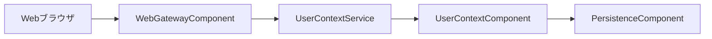
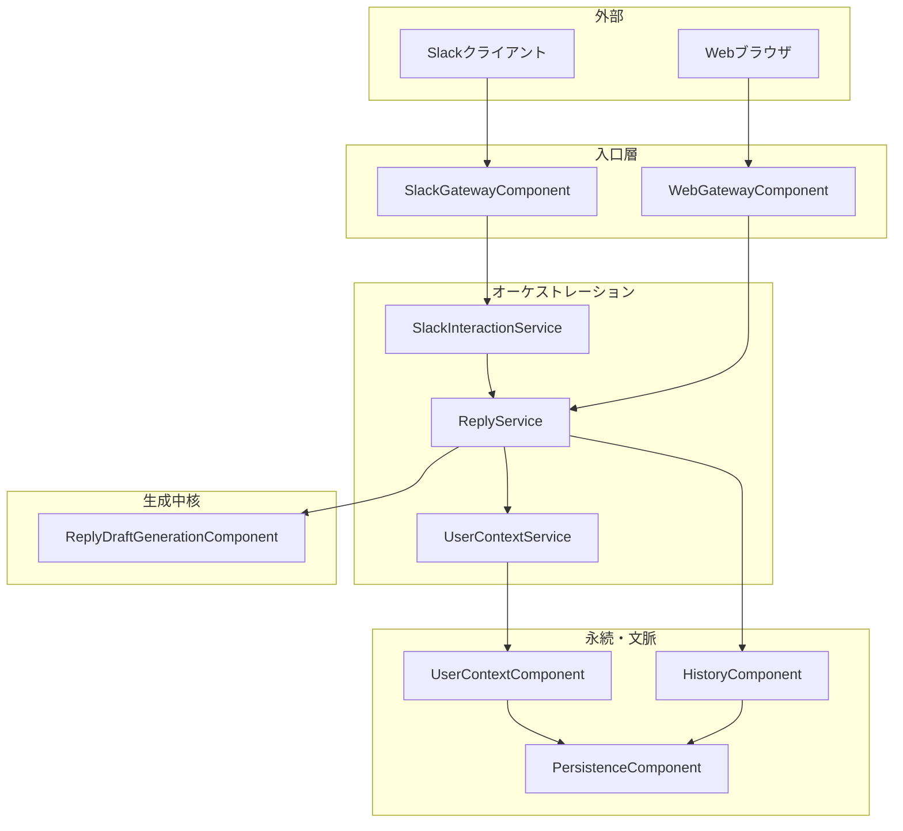
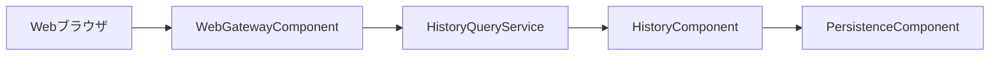

# アプリケーション設計（統合）

本書は、`components.md`、`component-methods.md`、`services.md` と並び、`component-dependency.md` を単一ソースに近い形で詳述した統合ドキュメントです。実装順・レビューの起点として利用する。

---

## 1. 設計概要

### 1.1 システム境界

| 項目 | 内容 |
|------|------|
| 入力チャネル | Slack（Slash Command）、Web |
| 認証 | OAuth（Cognito Hosted UI を想定） |
| 永続化 | RDB（ユーザー・履歴・**ユーザー単位コンピテンシー／自己コンテキスト**） |
| 生成 | LLM を用いた返信ドラフト生成（送信前は `reply-draft`、送信確定後は `reply`） |

### 1.2 要件との対応（コンピテンシー）

- **FR-04（会社の評価制度・コンピテンシー入力／任意）**: ユーザーが Web で**任意に**コンピテンシーを**自由テキストで登録**できる。**登録した場合**のみそれを生成の拘束条件として用いる。
- **生成方針**: 登録済みの `competencyText` は **`UserContextComponent` に永続化**され、`ReplyDraftGenerationComponent` のプロンプトに**明示的に織り込む**。**未登録または空の場合**はドラフト生成を拒否せず、`ReplyDraftGenerationComponent` で**汎用ビジネス調フォールバック**のプロンプト分岐により生成する（要件 FR-04 のフォールバックと整合）。
- **Slack**: 同一ログインユーザーであれば **Web で保存したコンピテンシー（あれば）を `UserContextService` 経由で参照**。Slack 独自の並行ストアは持たない。ソースオブトゥルースは **ユーザー文脈（永続データ）**。未登録でもドラフト生成は可能（フォールバック）。
- **UX（任意）**: Web にコンピテンシー設定があることは精度向上に有益だが、**登録しないことはエラーではない**。

### 1.3 核心ユースケース

| # | ユースケース | 主チャネル | 備考 |
|---|----------------|------------|------|
| U1 | **コンピテンシー／文脈の登録・更新・参照** | **Web（任意・推奨）** | **登録しないユーザーも許容**。コンピテンシーはユーザーごと。**Slack は登録 UI を持たず参照のみ（間接）。** |
| U2 | **返信ドラフト生成** | Web / Slack | `replyTargetMessageText` + `emotionText`。**`competencyText`・自己コンテキストはあれば付与**。なければフォールバック生成。 |
| U3 | **送信確定と送信済み履歴記録** | Web / Slack | 確定済み文案の送信処理と `reply` 履歴 |
| U4 | **送信済み返信一覧** | Web | 読み専用 |

### 1.4 アーキテクチャの原則

- **一方向依存**: 外側（Gateway）から内側へ。**永続化は `PersistenceComponent` に集約**。
- **チャネル IO の分離**: `SlackGatewayComponent` / `WebGatewayComponent` はプロトコル変換のみ。
- **コンピテンシー単一ソース**: 永続レイヤーの `UserContext`（`UserContextComponent`）。**読み書きパスと生成パスが同じデータを参照**するよう `UserContextService` を強制する。
- **共有オーケストレーション**: ドラフト生成・送信は **`ReplyService`**。Slack は **`SlackInteractionService`** を挟む。
- **処理モデル**: 原則 **同期**.

### 1.5 責務分離（保守性・拡張性）

次のように **論理単位が重ならない**ようにする（詳細は `components.md` / `services.md` / `component-methods.md`）。

| 論理単位 | 担うもの | 持たせないもの |
|----------|----------------|----------------|
| **`SlackGatewayComponent`** | Slack 署名・Webhook 適合。**ドメイン結果 → Slack メッセージ体裁**は **`SlackReplyPresentationMapper`** | Slash の引数正規化・本人解決・LLM／履歴 |
| **`SlackInteractionService`** | Slash → **正規化済み入力**・**`LinkedIdentityResolverService`** への委譲・**`ReplyService` 転送**。戻りは **チャネル中立 outcome** | Block Kit 詳細、`UserContext` 直接読取 |
| **`LinkedIdentityResolverService`** | **`team_id/user_id → internalUserId`** のみ（永続リンク） | Slash 入力解釈、生成 |
| **`ReplyService`** | 文脈取得 → **`ReplyDraftContextAssembler`** → **`ReplyDraftGeneration`** → 履歴保存の順番 | HTTP／Slack 体裁 |
| **`ReplyDraftContextAssembler`** | 永続 `UserContext` + 入力から **`ReplyDraftInput` 構築** | 永続化、プロンプト文面の細部・LLM I/O |
| **`ReplyDraftGenerationComponent` 群** | **PromptBuilder**（ルール集中）／**LanguageModelClient**（インフラ）／**OutputNormalizer**（後処理）の管轄分界 | DB、HTTP |
| **`UserContextComponent`** | `UserContext` の読み書きだけ | 「LLM 向け」の組み立て |
| **`WebGateway`** | HTTP 入力検証・認証済みユーザーの決定、`UserContext`／`Reply`／`History` へのルーティング | コンテキスト永続本体、生成アルゴリズム |

---

## 2. 論理レイヤーと責務（コンピテンシー反映済み）

```
+------------------------------------------------------------+
|  外部: Slack / Webブラウザ                                    |
+---------------------------+--------------------------------+
|  入口層                                                     |
|  SlackGatewayComponent    | WebGatewayComponent            |
|                           | （ドラフト／送信／履歴＋**文脈API**）  |
+---------------------------+--------------------------------+
|  SlackInteractionService  |                                |
+---------------------------+--------------------------------+
|  ReplyService | HistoryQueryService | UserContextService*  |
+---------------------------+----------------+----------------+
|  ReplyDraftGenerationComponent | HistoryComponent          |
|  UserContextComponent     | AuthComponent                  |
+---------------------------+--------------------------------+
|  PersistenceComponent                                     |
+------------------------------------------------------------+
```
* **`UserContextService`**: **`UserContext` はドメインユーザー単位の共有データ**であり、チャネルの所有ではない。**HTTP による GET/PUT は現状 Web**（`WebGatewayComponent` が **`internalUserId` 単位で**呼び出し）。**ドラフト生成前の読込**はすべて **`ReplyService` → `UserContextService`** と同一経路。**Slack 等でも `ReplyService` が同じコンテキストを参照**する。外部 IO と `internalUserId` の紐付けは `component-methods.md`「共通」の節および Functional Design で定義する。

### 2.1 コンピテンシーと生成のデータ契約（重要）

永続モデル（論理項目名・実際のカラムは Functional Design 側）。

| フィールド（論理名） | 説明 |
|----------------------|------|
| `competencyText` | FR-04 相当。評価基準・コンピテンシー定義。**任意。Web で登録した場合のみ非空。登録時は生成の主ターゲット。** |
| `selfCurrentText` / `selfGoalText` （任意） | FR-05。未設定でも生成は可。 |

**`ReplyDraftInput`（生成コンポーネントへ渡す論理モデル）**には、最低限次を埋めてから `generateReplyDraft` を呼ぶ。

- `replyTargetMessageText`, `emotionText`
- **`competencyText`（ユーザー保存値。空／未登録可 → 生成コンポーネントがフォールバック分岐）**
- （任意）自己コンテキスト各フィールド

`ReplyService` の責務: **ドラフト生成前に `UserContextService.getUserContext(userId)` で文脈を取得** → **`ReplyDraftContextAssembler` で `ReplyDraftInput` を組み立て** → **`ReplyDraftGenerationComponent` に渡す**。**`competencyText` 未設定を理由に生成を拒否しない**。Slack／Web で同一ルールを共有する。

### 2.2 入口層

| コンポーネント | 役割 |
|----------------|------|
| `SlackGatewayComponent` | Slack 署名・Webhook。**`SlackInteractionService`** および **`SlackReplyPresentationMapper`** と協調。エンドポイント: `/slack/commands/generate-reply-draft`, `/slack/commands/send-reply` |
| `WebGatewayComponent` | **コンピテンシー／文脈の GET／PUT**。返信ドラフト・送信・履歴（ルート分割実装可）。エンドポイント一覧は §3.1 |

### 2.3〜2.6

`ReplyService` / `UserContextService` / **`ReplyDraftContextAssembler`** / **`ReplyDraftGenerationComponent`（および内包 PromptBuilder／LanguageModelClient／Normalizer）** / `HistoryComponent` の境界は、`components.md` §1.5 の表と一致させる。**`ReplyDraftPromptBuilder`** が **`competencyText` の有無による拘束／フォールバック文言**を担う。また **`UserContextService` は Gateway 由来の書き込みと `ReplyService` 由来の読み込み**の両対応とし、`UserContextComponent` は永続モデルのみ担当する。

---

## 3. 依存関係の全体像

### 3.1 HTTP 一覧（論理）

| メソッド | パス | 目的 |
|---------|------|------|
| GET | `/web/user-context` | **ログインユーザーのコンピテンシー等を取得（フォーム初期表示）** |
| PUT | `/web/user-context` | **コンピテンシー等を登録・更新** |
| POST | `/web/reply-drafts` | ドラフト生成（内部でユーザー文脈を**参照**。コンピテンシーは任意） |
| POST | `/web/replies` | 送信 |
| GET | `/web/replies/history` | 送信済み一覧 |
| POST | `/slack/commands/generate-reply-draft` | ドラフト生成（ユーザー同定後、`UserContext` を**読むがコンピテンシーは任意**） |
| POST | `/slack/commands/send-reply` | 送信 |

### 3.2 依存マトリクス

| From | To | 目的 |
|------|-----|------|
| `SlackGatewayComponent` | `SlackInteractionService` | Slash アプリ入力化・転送 |
| `SlackGatewayComponent` | `SlackReplyPresentationMapper` | ドメイン outcome → Slack 応答体裁 |
| `SlackInteractionService` | `LinkedIdentityResolverService` | Slack メンバー → `internalUserId` |
| `SlackInteractionService` | `ReplyService` | ドラフト／送信オーケストレーション転送 |
| `LinkedIdentityResolverService` | `PersistenceComponent` | Slack リンク参照 |
| `WebGatewayComponent` | `AuthService` | セッション検証・`internalUserId` 取得（読取専用オーケストレーション） |
| `WebGatewayComponent` | `ReplyService` | ドラフト／送信 |
| `WebGatewayComponent` | `HistoryQueryService` | 送信済み履歴一覧 |
| **`WebGatewayComponent`** | **`UserContextService`** | **コンピテンシー／文脈の取得・更新** |
| `ReplyService` | `UserContextService` | **生成前の文脈読み込み** |
| **`ReplyService`** | **`ReplyDraftContextAssembler`**（協調／内部モジュール） | **`ReplyDraftInput` 組み立て** |
| `ReplyService` | `ReplyDraftGenerationComponent` | ドラフト生成（内包 PromptBuilder／LanguageModel／Normalizer） |
| `ReplyService` | `HistoryComponent` | 履歴書き込み |
| `HistoryQueryService` | `HistoryComponent` | 履歴読み |
| `AuthService` | `AuthComponent` | OAuth |
| `UserContextService` | `UserContextComponent` | 読み書き本体 |
| `HistoryComponent` / `UserContextComponent` / `AuthComponent` | `PersistenceComponent` | DB |

---

## 4. 処理フロー図

### 4.1 Web: コンピテンシー登録／更新（任意）



**テキスト代替**: Web → `WebGatewayComponent` → `UserContextService` → `UserContextComponent` → `PersistenceComponent`。

### 4.2 返信ドラフト生成（コンピテンシー読み込みを含む・Slack / Web 合流）



**テキスト代替**: Web／Slack とも `ReplyService` が `UserContextService` でコンテキスト取得 → `ReplyDraftContextAssembler` が `ReplyDraftInput` を組み立て → `ReplyDraftGeneration`（内包 PromptBuilder の拘束／フォールバック、LanguageModel が推論）でドラフト生成 → `HistoryComponent`。Slack では、その戻りを `SlackReplyPresentationMapper` が Slash 応答へ写像する（詳細フローは `component-dependency.md`）。

### 4.3 Web: 送信済み履歴一覧（変更なし）



---

## 5. データフロー（詳細）

### 5.1 Web: ドラフト生成（コンピテンシーあり／なし）

| 順 | 処理 |
|---|------|
| 1 | （任意）ユーザーがログイン済み状態で **`PUT /web/user-context`** により **`competencyText` を保存**。 |
| 2 | **`POST /web/reply-drafts`** で `replyTargetMessageText`、`emotionText` を送信。 |
| 3 | `ReplyService` が `UserContextService` でコンテキスト取得（**`competencyText` 有無に関わらず次へ進む**）。 |
| 4 | **`ReplyDraftContextAssembler` が `ReplyDraftInput` を構築**。 |
| 5 | **`ReplyDraftPromptBuilder`**／**LanguageModel**／**OutputNormalizer** からなる **`ReplyDraftGeneration`** がドラフトを生成（非空コンピテンシー拘束／フォールバックは PromptBuilder が担当）。 |
| 6 | ドラフト履歴保存・JSON 応答返却。 |

### 5.2 Slack でのドラフト生成

`SlackGateway` が署名確認後、`SlackInteractionService` が Slash を **`LinkedIdentityResolverService` で本人解決**して **`ReplyService` に転送**。以降 §5.1 の 3〜6 と同一。戻りの **ドメイン outcome** を **`SlackReplyPresentationMapper` が Slash 応答へ**写像する。  
  
Slack で追加のコンピテンシー入力はしない。**Web で保存した `competencyText`（あれば）** を `UserContextService` が参照できる。未登録時もドラフト生成はフォールバックで実行される。

### 5.3 送信・履歴一覧

従前通り §1.3 の U3/U4。

---

## 6. 通信パターン・エラー伝播・非機能

- Web の **コンテキスト API** と **ドラフト API** はいずれも **Gateway → UserContextService または ReplyService**。
- **`competencyText` の未設定はエラー種別とはしない**。
- **例外・エラー**: Service／Domain が **型付き outcome または検査済み業務エラー**を返し、Gateway が **HTTP／Slack ユーザー向け**に写像。**横断ログ・コード付与は `ErrorHandlingService`**（`services.md` のレイヤ規約）。
- 同期・タイムアウト要件は既存 NFR と整合。

---

## 7. 設計決定ログ（この版での更新）

| 項目 | 内容 |
|------|------|
| 責務分離 | §1.5 および `components.md`：**Slack 署名と体裁**、`SlackInteraction`（入力＋転送）、**本人解決**、** Assembler**、**生成パイプライン内訳**を分離。 |
| Web コンピテンシー | **任意登録**。`GET/PUT /web/user-context`。未登録ユーザーもドラフト生成可。 |
| 生成との関係 | **`competencyText` があれば拘束としてプロンプトに含め、無ければ汎用フォールバック**。要件 FR-02・FR-04 と整合。 |
| Slack | コンピテンシー入力なし。**永続コンテキストの読みのみ**。未設定時もフォールバック生成。 |
| Web UI | **コンピテンシー入力は任意**。精度を上げたいユーザー向けに Web に設定欄またはページを提供するのは推奨。 |

---

## 8. 成果物クロスリファレンス

| ファイル | 内容 |
|----------|------|
| `components.md` | エンドポイントおよびコンポーネント責務（本書 §3.1 と整合） |
| `component-methods.md` | メソッドシグネチャ |
| `services.md` | オーケストレーション手順・コンピテンシー検証ステップ |
| `component-dependency.md` | 依存マトリクス・フロー図（本書 §3.2 / §4 と整合） |

---

## 9. 次フェーズへの引き継ぎ

- **Functional Design**: `UserContextPayload` の正確な構造、`competencyText` の最大長、`PUT` と `POST reply-drafts` のトランザクション境界。
- **Units**: `web-user-context`、`reply-generation`、`slack-adapter`、`persistence-user-context` 等への分割検討。

---

*本版: コンピテンシー任意登録＋フォールバック生成、および責務分離（§1.5）による保守性強化*
