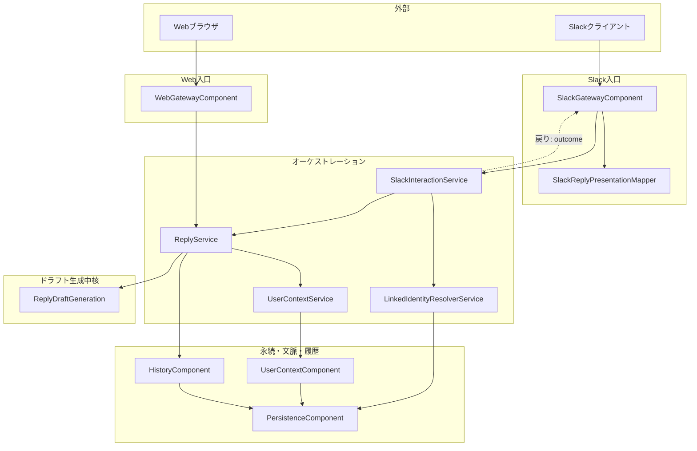
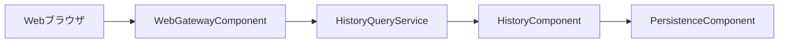
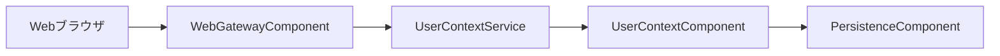

# コンポーネント依存関係

## 依存関係方針
- 外側（Gateway）から内側（Service/Domain）への一方向依存
- **入力正規化・本人解決・ユースケース・チャネル体裁**をレイヤ単位で分離する（`application-design.md` §1.5）
- 永続化アクセスは PersistenceComponent を経由して統制

## レイヤーのイメージ

- **`SlackGatewayComponent`**: Slack 署名・Webhook 適合のみが責務の中心。**結果の Slack メッセージ体裁**は **`SlackReplyPresentationMapper`** と協調。**Slash の意味的正規化**はしない。
- **`SlackInteractionService`**: Slash → **`LinkedIdentityResolverService`** → **`ReplyService`**。**UserContext は直接読まず**。**Slack メッセージ組み立てはしない**。
- **`LinkedIdentityResolverService`**: **`team_id`/`user_id` → `internalUserId`** に専念（永続リンク）。
- **本文生成のオーケストレーション**はすべて **`ReplyService`**（ **`ReplyDraftContextAssembler`** → **`ReplyDraftGeneration`** 内 PromptBuilder／LanguageModel／Normalizer → **`History`** ）。
- Web の送信済み履歴一覧は **`HistoryQueryService` → `HistoryComponent`** を経由。**ゲートウェイは一覧で `HistoryComponent` を迂回しない運用とする**。

## 返信ドラフト生成のフロー図（Slack / Web が合流）

（同期呼び出しの戻り:**`SlackInteractionService` が `ReplyService` を完了させた結果**をゲートウェイへ返し、その後 **`SlackReplyPresentationMapper`** が応答オブジェクトへ写像）

### テキスト代替（Mermaid が読めない場合）

**Slack**

1. `SlackGatewayComponent` が署名検証し `SlackInteractionService` に委譲  
2. `SlackInteractionService` が Slash を正規化し **`LinkedIdentityResolverService`** で `internalUserId` を確定してから **`ReplyService`** へ  
3. `ReplyService` は **`UserContextService`** → **`ReplyDraftContextAssembler`** → **`ReplyDraftGeneration`** → **`HistoryComponent`** の順で呼ぶ  
4. 戻りの **チャネル中立 outcome** を `SlackGatewayComponent` が **`SlackReplyPresentationMapper`** と協調して Slash 応答へ  

**Web**

`WebGatewayComponent` → **`ReplyService`** → 同上の 3。**JSON 応答のみ**なら Mapper 相当は薄いレイヤまたはゲートウェイ内で完結させる。

## Web: 送信済み履歴一覧の読み経路（参考）

### テキスト代替

`Webブラウザ`→`WebGatewayComponent`→`HistoryQueryService`→`HistoryComponent`→`PersistenceComponent`

## Web: コンピテンシー／ユーザー文脈の保存経路（`GET/PUT /web/user-context`・任意）

### テキスト代替

`Webブラウザ`→`WebGatewayComponent`→`UserContextService`→`UserContextComponent`→`PersistenceComponent`

## 依存マトリクス（主要経路）

| From | To | 目的 |
|---|---|---|
| SlackGatewayComponent | SlackInteractionService | Slash アプリ入力化・転送 |
| SlackGatewayComponent | SlackReplyPresentationMapper | outcome → Slash 応答体裁 |
| SlackInteractionService | LinkedIdentityResolverService | Slack メンバー → internalUserId |
| SlackInteractionService | ReplyService | ドラフト／送信ユースケース転送 |
| LinkedIdentityResolverService | PersistenceComponent | リンク検索・参照 |
| WebGatewayComponent | AuthService | セッション・internalUserId |
| WebGatewayComponent | ReplyService | Web ドラフト／送信 |
| WebGatewayComponent | UserContextService | `/web/user-context` |
| WebGatewayComponent | HistoryQueryService | 履歴一覧 |
| ReplyService | UserContextService | 生成前文脈読取 |
| ReplyService | ReplyDraftGenerationComponent | ドラフト生成（PromptBuilder／LLM／Normalizer） |
| ReplyService | HistoryComponent | ドラフト／送信済み履歴の書込 |
| HistoryQueryService | HistoryComponent | 履歴読取 |
| AuthService | AuthComponent | OAuth／Web の internalUserId |
| UserContextService | UserContextComponent | 文脈永続読書き |
| HistoryComponent | PersistenceComponent | DB アクセス |
| UserContextComponent | PersistenceComponent | DB アクセス |
| AuthComponent | PersistenceComponent | セッション等 |
## 通信パターン
- Slack: `Gateway` → （`Presentation` で戻り写像）
- Slack: `Gateway` → `SlackInteraction` → `LinkedIdentityResolver`/`ReplyService`/… の **入り側**
- Web: `Gateway` → `ReplyService` / `UserContextService` / `HistoryQueryService`

## データフロー（テキスト）
1. 外部から返信ドラフト入力をゲートウェイまたは `SlackInteraction` が **`internalUserId` 単位まで解決済みドメイン呼び出しに変換**
2. `ReplyService` が **`UserContextService` で文脈取得** → **`ReplyDraftContextAssembler` で入力 DTO を構築** → `ReplyDraftGeneration` で拘束／フォールバックを含む生成 → ドラフト履歴保存
3. ユーザー確定後、送信と送信済み履歴保存
4. Slack のときだけ **Presentation Mapper** がユーザー向け本文を組む

## 例外・エラー伝播
- Service／Domain の業務結果を **Gateway と `SlackReplyPresentationMapper` がユーザー文言へ**
- **`ErrorHandlingService`** が監視・エラーコードの横断付与を担う（`services.md` 参照）
