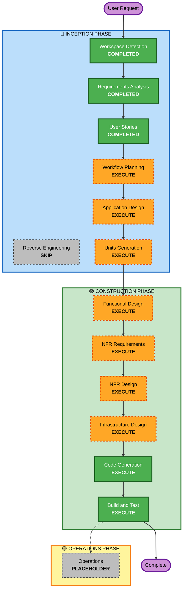

# Execution Plan

## Detailed Analysis Summary

### Request Summary
- **Primary Goal**: Slack連携 + Web履歴参照を備えた、感情/意図を自然なビジネス文へ変換するMVPを構築する
- **Project Type**: Greenfield
- **Complexity**: Medium（LLM連携、認証、履歴保存、複数チャネル）

### Change Impact Assessment
- **User-facing changes**: Yes（主要機能のすべてがユーザー体験に直結）
- **Structural changes**: Yes（Slackアプリ + Web + API + 認証 + DB）
- **Data model changes**: Yes（ユーザー、履歴、コンテキスト、生成結果）
- **API changes**: Yes（Web/API/Slack入口の統一）
- **NFR impact**: Yes（応答時間、プライバシー、可用性）

### Risk Assessment
- **Risk Level**: Medium
- **Rollback Complexity**: Moderate（MVPだが複数機能が連動）
- **Testing Complexity**: Moderate（生成品質 + API + 認証の結合検証が必要）

## Workflow Visualization

### Text Alternative
- INCEPTION: Workspace Detection (COMPLETED) -> Requirements Analysis (COMPLETED) -> User Stories (COMPLETED) -> Workflow Planning (EXECUTE) -> Application Design (EXECUTE) -> Units Generation (EXECUTE)
- CONSTRUCTION: Functional Design (EXECUTE) -> NFR Requirements (EXECUTE) -> NFR Design (EXECUTE) -> Infrastructure Design (EXECUTE) -> Code Generation (EXECUTE) -> Build and Test (EXECUTE)
- OPERATIONS: Placeholder

## Phases to Execute

### 🔵 INCEPTION PHASE
- [x] Workspace Detection (COMPLETED)
- [x] Reverse Engineering (SKIPPED - Greenfieldのため)
- [x] Requirements Analysis (COMPLETED)
- [x] User Stories (COMPLETED)
- [x] Workflow Planning (IN PROGRESS)
- [ ] Application Design - EXECUTE
  - **Rationale**: Slack/Web/API/認証/DB間の責務分離とサービス境界を定義する必要がある
- [ ] Units Generation - EXECUTE
  - **Rationale**: 複数機能を独立した実装単位に分解する必要がある

### 🟢 CONSTRUCTION PHASE
- [ ] Functional Design - EXECUTE
  - **Rationale**: 変換ロジック、履歴処理、エラー系を詳細化する必要がある
- [ ] NFR Requirements - EXECUTE
  - **Rationale**: 応答時間、プライバシー、品質を測定可能な要件へ落とす必要がある
- [ ] NFR Design - EXECUTE
  - **Rationale**: NFR達成のための設計パターンを定義する必要がある
- [ ] Infrastructure Design - EXECUTE
  - **Rationale**: AWSサービス構成（Bedrock/RDS/Cognito等）を具体化する必要がある
- [ ] Code Generation - EXECUTE (ALWAYS)
  - **Rationale**: 実装計画とコード生成が必要
- [ ] Build and Test - EXECUTE (ALWAYS)
  - **Rationale**: MVP品質確認とデモ安定性確保が必要

### 🟡 OPERATIONS PHASE
- [ ] Operations - PLACEHOLDER
  - **Rationale**: 将来拡張フェーズ

## Estimated Timeline
- **Total Stages (remaining, excluding placeholder)**: 8
- **Estimated Duration**: ハッカソン向け短期（1〜3日相当の密度で実施可能）

## Success Criteria
- 自然で意図を汲み取ったビジネス文章が安定して生成される
- Slack連携とWeb履歴参照が同一品質で成立する
- OAuth認証下で履歴がユーザー単位に保護される

## Extension Compliance Summary
- **Security Baseline**: N/A（`aidlc-state.md`で無効設定）
- **Property-Based Testing**: N/A（`aidlc-state.md`で無効設定）
