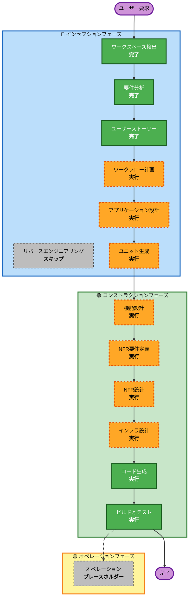

# 実行計画

## 詳細分析サマリー

### リクエスト要約
- **主目的**: Slack連携 + Web履歴参照を備えた、感情/意図を自然なビジネス文へ変換するMVPを構築する
- **プロジェクト種別**: グリーンフィールド
- **複雑度**: 中程度（LLM連携、認証、履歴保存、複数チャネル）

### 変更影響評価
- **ユーザー影響**: あり（主要機能のすべてがユーザー体験に直結）
- **構造変更**: あり（Slackアプリ + Web + API + 認証 + DB）
- **データモデル変更**: あり（ユーザー、履歴、コンテキスト、生成結果）
- **API変更**: あり（Web/API/Slack入口の統一）
- **NFR影響**: あり（応答時間、プライバシー、可用性）

### リスク評価
- **リスクレベル**: 中
- **ロールバック難易度**: 中（MVPだが複数機能が連動）
- **テスト難易度**: 中（生成品質 + API + 認証の結合検証が必要）

## ワークフロー可視化

### テキスト代替表現
- インセプション: ワークスペース検出（完了） -> 要件分析（完了） -> ユーザーストーリー（完了） -> ワークフロー計画（実行） -> アプリケーション設計（実行） -> ユニット生成（実行）
- コンストラクション: 機能設計（実行） -> NFR要件定義（実行） -> NFR設計（実行） -> インフラ設計（実行） -> コード生成（実行） -> ビルドとテスト（実行）
- オペレーション: プレースホルダー

## 実行フェーズ

### 🔵 インセプションフェーズ
- [x] ワークスペース検出（完了）
- [x] リバースエンジニアリング（スキップ - グリーンフィールドのため）
- [x] 要件分析（完了）
- [x] ユーザーストーリー（完了）
- [x] ワークフロー計画（進行中）
- [ ] アプリケーション設計 - 実行
  - **理由**: Slack/Web/API/認証/DB間の責務分離とサービス境界を定義する必要がある
- [ ] ユニット生成 - 実行
  - **理由**: 複数機能を独立した実装単位に分解する必要がある

### 🟢 コンストラクションフェーズ
- [ ] 機能設計 - 実行
  - **理由**: 変換ロジック、履歴処理、エラー系を詳細化する必要がある
- [ ] NFR要件定義 - 実行
  - **理由**: 応答時間、プライバシー、品質を測定可能な要件へ落とす必要がある
- [ ] NFR設計 - 実行
  - **理由**: NFR達成のための設計パターンを定義する必要がある
- [ ] インフラ設計 - 実行
  - **理由**: AWSサービス構成（Bedrock/RDS/Cognito等）を具体化する必要がある
- [ ] コード生成 - 実行（常時）
  - **理由**: 実装計画とコード生成が必要
- [ ] ビルドとテスト - 実行（常時）
  - **理由**: MVP品質確認とデモ安定性確保が必要

### 🟡 オペレーションフェーズ
- [ ] オペレーション - プレースホルダー
  - **理由**: 将来拡張フェーズ

## 想定スケジュール
- **残ステージ数（プレースホルダー除く）**: 8
- **想定期間**: ハッカソン向け短期（1〜3日相当の密度で実施可能）

## 成功基準
- 自然で意図を汲み取ったビジネス文章が安定して生成される
- Slack連携とWeb履歴参照が同一品質で成立する
- OAuth認証下で履歴がユーザー単位に保護される

## 拡張ルール適合サマリー
- **Security Baseline**: N/A（`aidlc-state.md`で無効設定）
- **Property-Based Testing**: N/A（`aidlc-state.md`で無効設定）
